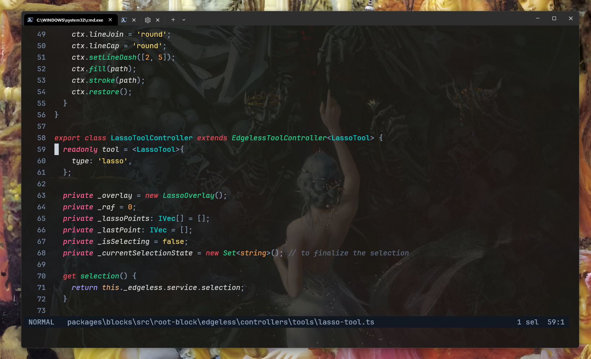

This is my helix editor config files.

- Has a custom theme ispired by the `fleet_dark_italic` theme from `VSCode`
- Some custom key bindings (__take a look in the themes/ folder__).
- the `golok_2` theme is the best.

> Use a dark background in your editor with a dark image for better experience:)

# Preview

